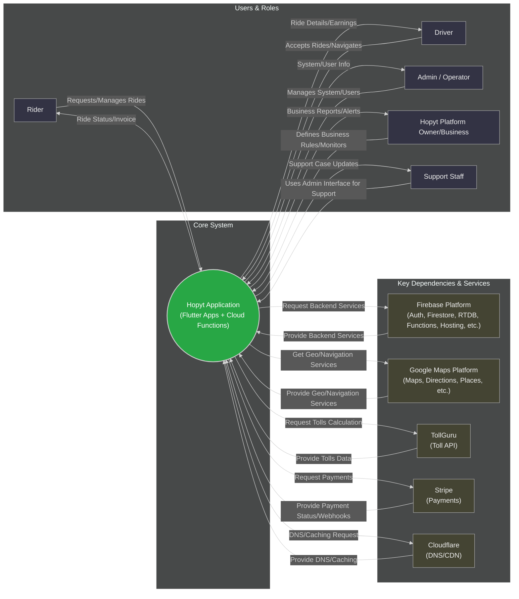

# Hopyt - Entity Level Diagram / Stakeholder Map

This diagram shows the main stakeholders, user roles, system entities, and external dependencies interacting with or supporting the Hopyt ride-hailing application, using a Left-to-Right layout and a dark theme.

I have updated the interactions in the Canvas to reflect your preferred flow and removed the inline comments from that section. The direct links between Support Staff and Rider/Driver have also been removed, ensuring interactions primarily go through the Core System, except for the necessary App Store downloads. Please check the preview on GitH
