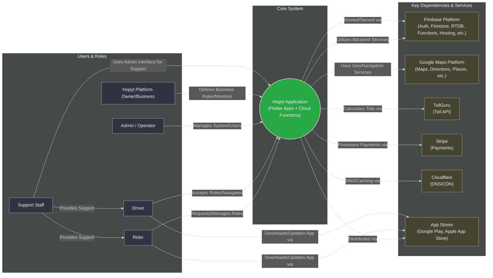

# Hopyt - Entity Level Diagram / Stakeholder Map

This diagram shows the main stakeholders, user roles, system entities, and external dependencies interacting with or supporting the Hopyt ride-hailing application, using a Left-to-Right layout and a dark theme.

